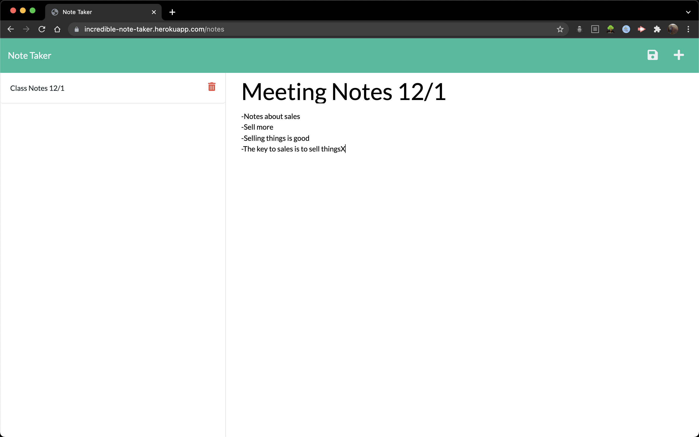

# Express Note-Taking Application

  ### A web application that allows you to write, save and delete persistent notes in a web browser.
  

  

  ## Table of Contents
  
  1. [Installation](#installation)
  2. [Usage](#usage)
  3. [Testing](#testing)
  4. [Screenshot](#screenshot)
  5. [Questions](#questions)
  
  ## Installation
  
  No installation necessary; please navigate to https://incredible-note-taker.herokuapp.com/ to use the deployed version of this app!
  
  ## Usage
  
    The user begins on a landing page, where they click on a button marked 'Get Started' in order to launch the application. This takes them to a page where they can enter a new note title and a corresponding note. They are then given a button to save their note. When they do so, the note populates on the left hand side of the screen, and they can click on any note in this history to view it again. At any time, they can click the button marked '+' in order to create a new note. There is also a trash can icon associated with each note in the history that allows them to delete that note.
  
  ## Testing

    npm test

  
  ## Screenshot
  
  Here's a screenshot of the program in action:

  
  
  ## Questions
  
  Please feel free to reach out!
  
  My email address is justinm099@mac.com  and my GitHub can be found at https://www.github.com/JustinM099. The repository for this project can be found at https://github.com/JustinM099/express-note-taker.

  Thank you!
